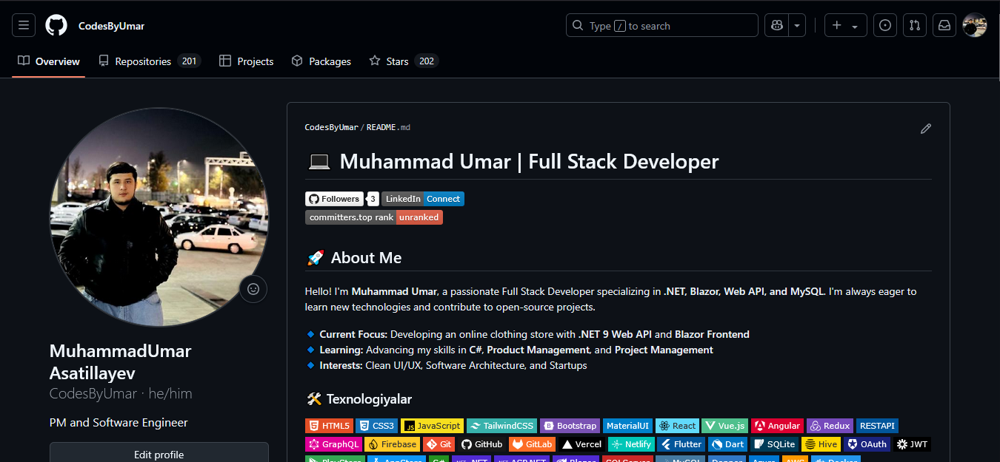

<h1 align="center">Hi there, I'm MuhammadUmar 👋</h1>
<h3 align="center">🚀 Full Stack Developer | .NET | Blazor | Web API | MySQL</h3>

  

---

### 🔧 Tech Stack & Tools

---

### 📊 GitHub Stats

  

  

  

---

### ✨ Projects I'm proud of

- 🛍 **Kingsman Kiyim Do‘koni** – Blazor + .NET 9 + Web API asosida e-commerce platforma
- 📚 **Books App** – C++ asosidagi kitob ilovasi
- 🐍 **Snake Game** – C# da o‘yin
- 🚖 **PHP Yandex Taxi API** – PHP orqali real API integratsiyasi

---

### 📫 Connect with me:

---

### ☕ Let's Collaborate!
Agar siz yaxshi fikrli odamlar bilan loyiha ustida ishlashni istasangiz — men ochiqman! 👨‍💻✨
